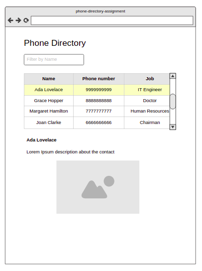

# Problem statement

To develop a simple phone directory app in under 45 minutes

## Guidelines

1. Use https://angular.io/ only. Googling not allowed.

2. Use editor of your choice. In case of slow internet, use https://codesandbox.io/

3. Your time is fixed, We will check how many points have you completed in the requirements.

4. Must code in angular, typescript.

## Dev notes

1. Create a new project / use online sites like codesandbox

2. `npm install` is also included in the 45 minutes if you do on your laptop

3. Be responsive to the interviewer. He will ask you random questions. We check for multitasking skills.

## Functional Requirements (to be developed in the same order)

1. Put the header "Phone Directory" 

2. Develop the table and load the data once on load. Use [mock data only](./mock-data.json)

3. The table should show only four rows and the rest should be scrollable

4. Make sure the **first row** of the table is selected and corresponding details are shown below the table

5. When clicked on table row, the details should be shown below. The selected table row should have a background color of yellow.

6. The image should be center aligned horizontally

7. Implement name filter input field. The table contents should be changed automatically when user enters data. 

8. When user clears the input field, then the table should show all the data.

9. Demo

10. Code walkthrough, code quality, look and feel

## Mock up

