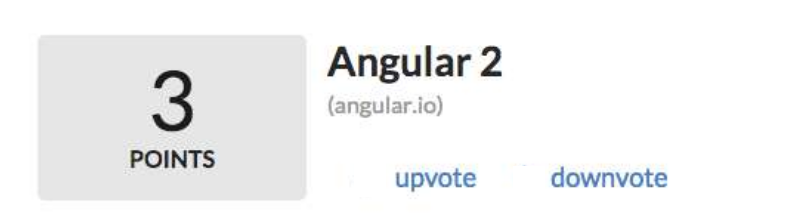

# Problem statement

To develop a simple reddit clone app behaviour in under 45 minutes

## Guidelines

1. Use https://angular.io/ only. Googling not allowed.

2. Use editor of your choice. In case of slow internet, use https://codesandbox.io/

3. Your time is fixed, We will check how many points have you completed in the requirements.

4. Must code in angular, typescript.

## Dev notes

1. Create a new project / use online sites like codesandbox

2. `npm install` is also included in the 45 minutes if you do on your laptop

3. Be responsive to the interviewer. He will ask you random questions. We check for multitasking skills.

## Mock up

Single component

## Acceptance criteria

1. The component should be reusable with `title` and `subtitle` as props.
2. The component with the highest counter score should come first and others ordered in descending order
